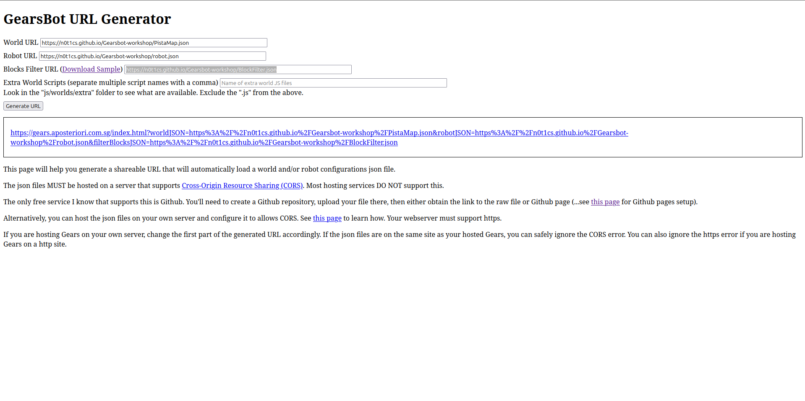
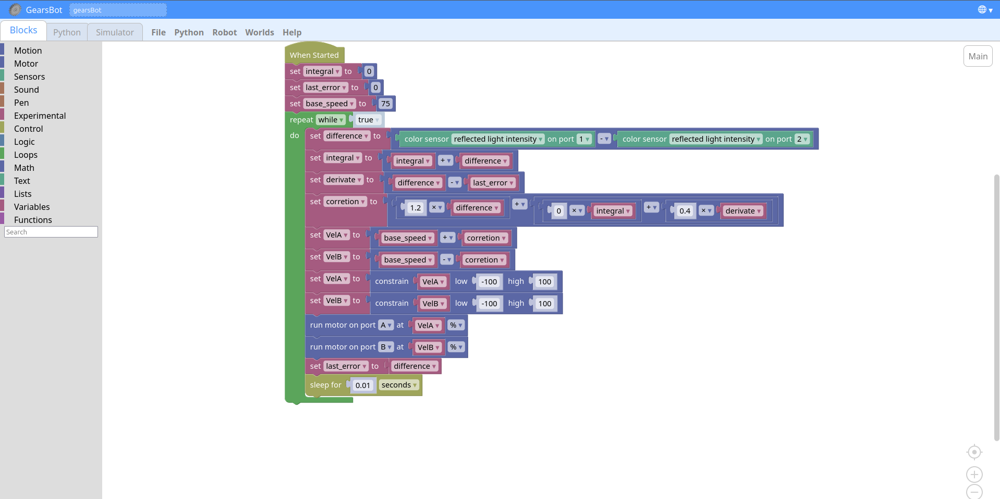

# Gearbots Workshop for MOSTRA SEI 2026

This repository contains the world, robot, maps, and helper files used in the Gearbots workshop.

## Quick Start

Use these links in the Gearbots URL generator:

- **Workshop world configuration** - https://n0t1cs.github.io/Gearsbot-workshop/PistaMap.json
- **Workshop robot configuration** - https://n0t1cs.github.io/Gearsbot-workshop/robot.json

### Block Filter Choice (Required)

For activities in this workshop, the block filter must use one of these modes:

- **LessBlocks** (https://n0t1cs.github.io/Gearsbot-workshop/LessBlocks.json): only the essential blocks for a PID line follower.  
  Best for beginner classes and step-by-step instruction.
- **MoreBlocks** (https://n0t1cs.github.io/Gearsbot-workshop/LessBloMoreBLocks.json): includes more blocks and options for experimentation.  
  Better for advanced students, but it can confuse beginners.

Reference image:

## Repository Structure

- **[BlockFilter.json](BlockFilter.json)** contains the block filter used to control which blocks students can access.
- **[PistaMap.json](PistaMap.json)** defines the workshop world, including the background, walls, and robot origin.
- **[robot.json](robot.json)** contains the robot configuration used in the workshop.
- **[maps/](maps)** contains the track images used as map backgrounds.
- **[Help_files/](Help_files)** contains examples, helper assets, and reference files.

## File Guide

### Root Files

- **[BlockFilter.json](BlockFilter.json)**: Configures which categories and blocks are available to students.  
  In this workshop, use it in one of two teaching modes: **LessBlocks** (PID essentials only) or **MoreBlocks** (expanded options for experimentation).  
  To hide a category, use the category ID, which matches the category name in English. To hide an individual block, use the block type from **[Help_files/toolbox.xml](Help_files/toolbox.xml)**. If you deny a category but explicitly show a block inside it, the category will still appear, with the other blocks hidden. This filter works best with the latest Gearbots version.
- **[PistaMap.json](PistaMap.json)**: Defines the map used in the simulator. You can generate or edit this file with the **[Gearbots World Builder](https://gears.aposteriori.com.sg/builder.html)**.
- **[robot.json](robot.json)**: Defines the robot used in the workshop. The current setup uses the default dual-sensor line follower robot. You can create or edit robot configurations with the **[Gearbots Configurator](https://gears.aposteriori.com.sg/configurator.html)**.

### Maps

The files in [maps/](maps) are track images with black lines on white backgrounds:

- [maps/Portimao.jpg](maps/Portimao.jpg)
- [maps/pista.jpeg](maps/pista.jpeg)
- [maps/pista.png](maps/pista.png)

### Help Files

- [Help_files/filter_example.json](Help_files/filter_example.json): Example block filter from Gearbots.
- [Help_files/main_code.xml](Help_files/main_code.xml): Example PID block code to upload into the simulator.
- [Help_files/toolbox.xml](Help_files/toolbox.xml): Reference toolbox file from the simulator source code, useful for finding block types when editing the block filter.

Example block program:

